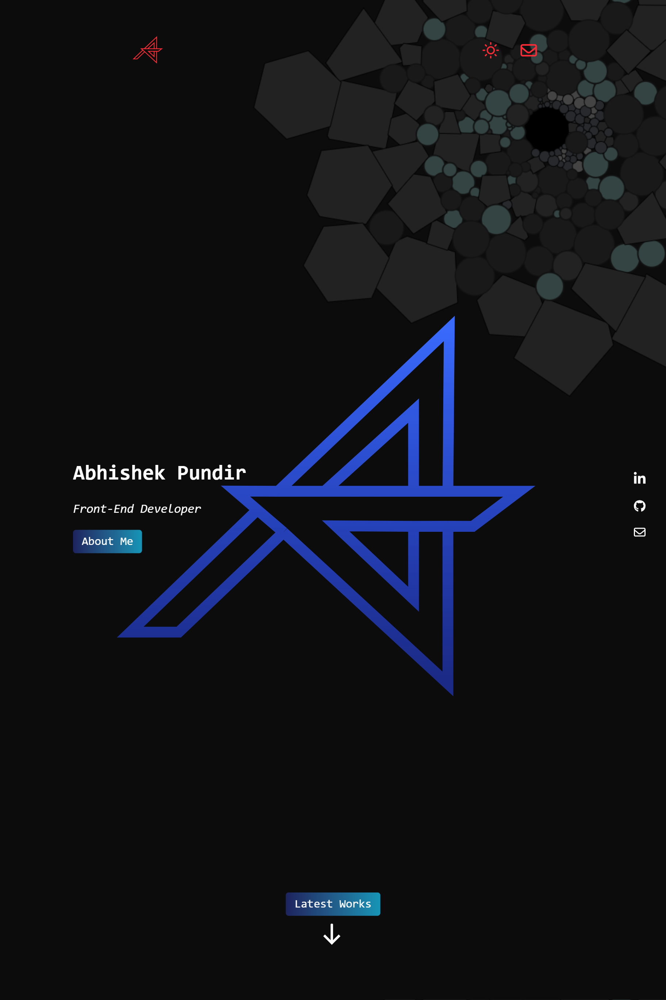
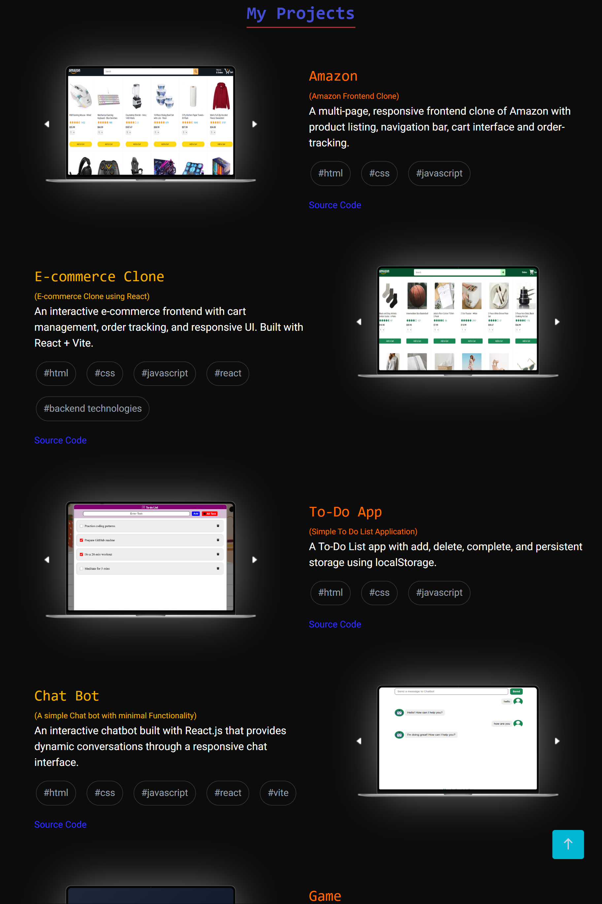
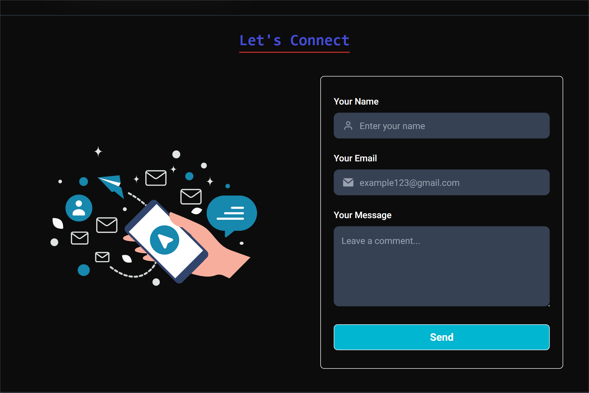
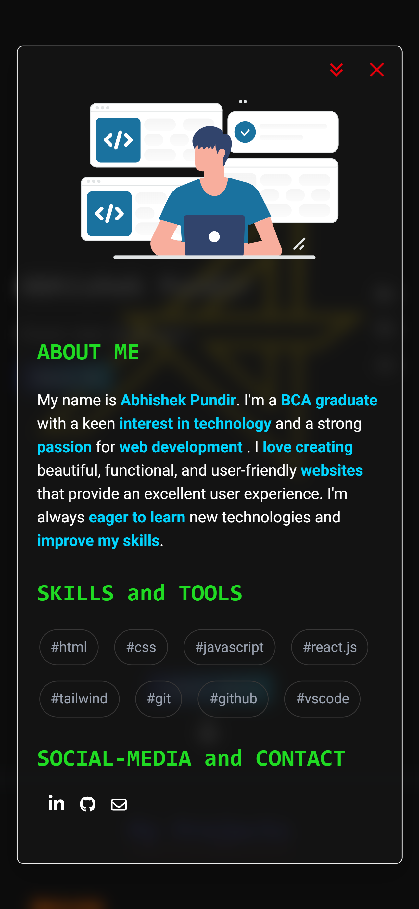
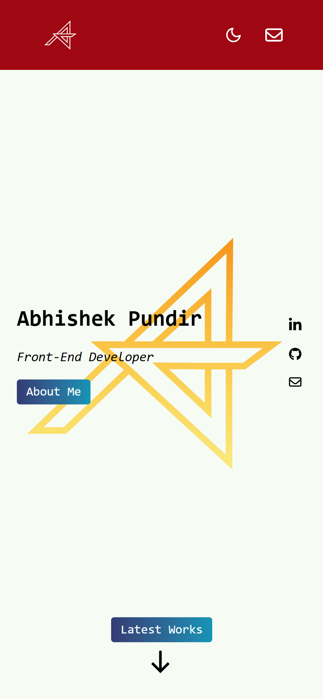

# 🌐 Personal Portfolio Website

A **modern, responsive, and interactive portfolio website** built using **React** and **Tailwind CSS**, designed to showcase my projects, skills, and experience in a visually appealing way.

---

## 🚀 Live Demo

🔗 [https://react-portfolio-ask.netlify.app/](https://react-portfolio-ask.netlify.app/)

---

## 📌 Features

- 🎨 **Responsive Design** – Fully optimized for desktop, tablet, and mobile.
- 🌗 **Dark / Light Mode** toggle with smooth transitions.
- 🧠 **About Me** section highlighting my journey, skills, and goals.
- 💼 **Project Showcase** displaying my key development projects with live demos.
- 📬 **Contact Section** with form and social media links.
- ⚡ **Smooth animations and transitions** for a professional user experience.
- 🚀 **Deployed on Netlify** for fast, reliable hosting.

---

## 🛠️ Tech Stack

- **React.js** – Component-based frontend framework
- **Tailwind CSS** – Utility-first styling and responsive design
- **JavaScript (ES6+)** – Core logic and interactivity
- **Vite** – Lightning-fast development environment
- **Netlify** – Deployment and hosting platform

---

## 📸 Project Screenshots

### 🏠 Homepage/Hero-Section

### 💼 Projects Section

### 💼 Contact Section

### 💻 About

### 🌗 Dark Mode

### ☀️ Light Mode

